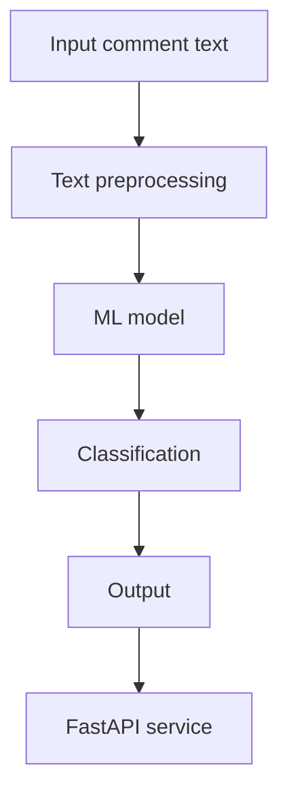

# ML System Design Document

## Зачем идем в разработку продукта?

Модерация пользовательских комментариев — ключевая задача для онлайн-платформ, таких как форумы, соцсети, новостные сайты. Огромный поток сообщений невозможно проверять вручную, при этом токсичный контент вредит бренду, провоцирует конфликты и нарушает правила платформы.

Цель проекта — разработать модель, способную определять токсичность текста. Это поможет:
- автоматизировать модерацию;
- повысить безопасность и комфорт пользователей;
- снизить нагрузку на модераторов.

## Бизнес-требования и ограничения

**Требования:**
- Высокая точность на токсичных примерах (Recall ≥ 90%)
- Скорость ответа сервиса ≤ 100 мс
- API-интерфейс с простой интеграцией
- Интерпретируемость — важна возможность объяснить результат

**Ограничения:**
- Используются только публичные датасеты
- Вычисления на CPU (без GPU)
- Язык: русский или английский (по составу датасета)

## Что входит в скоуп проекта / итерации

**Входит:**
- EDA и анализ данных
- Подготовка и обучение baseline и основной модели
- Разработка FastAPI-инференса
- Минимальное нагрузочное тестирование
- Документирование архитектуры и процесса

**Не входит:**
- Продакшн-инфраструктура (k8s, CI/CD)
- Многоклассовая классификация (тип токсичности)
- Онлайн-обучение модели

## Предпосылки решения

Проблема токсичных комментариев хорошо изучена. Существуют:
- открытые датасеты (Jigsaw Toxic Comments, RuToxic и др.);
- готовые модели на основе BERT, RoBERTa и др.;
- библиотеки для быстрой интеграции (HuggingFace Transformers, scikit-learn и пр.).

Таким образом, MVP можно реализовать быстро и эффективно.

## Постановка задачи

**Задача:** бинарная классификация текстов на токсичные (`1`) и нетоксичные (`0`).

**Вход:** текст комментария  
**Выход:** метка `0` или `1` + вероятность

**Метрики качества:** f1-score, recall (для `1`), ROC-AUC

## Блок-схема решения

*Пояснение:*
- Input comment text — входной текст комментария
- Text preprocessing — очистка, токенизация
- ML model — обученная модель (например, BERT)
- Classification — определение токсичности
- Output — метка (0 или 1) и вероятность
- FastAPI service — REST API для инференса

## Прочая информация

- Репозиторий: https://github.com/MikhaylovVladimir/toxic-comments-detector
- Основной язык: Python 3.9
- Линтеры: ruff, black
- Препроцессинг: pandas, nltk
- Модели: sklearn, transformers (BERT-like)

## Этапы решения задачи

### Этап 1. Подготовка данных

**Описание данных:**

- Использован датасет Jigsaw Toxic Comment Classification (Kaggle)
- Формат: `.csv`, 159571 строк, 8 столбцов
- Столбцы:
  - `id`: уникальный идентификатор комментария
  - `comment_text`: текст комментария
  - Метки (`0` или `1`): `toxic`, `severe_toxic`, `obscene`, `threat`, `insult`, `identity_hate`

**Качество данных:**

- Пропущенные значения отсутствуют
- Типы данных корректны (int64 / object)
- Данные сбалансированы слабо — некоторые классы встречаются крайне редко (например, `threat`, `identity_hate`)
- Много мультиметок: комментарий может относиться к нескольким классам одновременно

**EDA — основные наблюдения:**

- `toxic` — наиболее частая метка (~10%)
- `threat`, `identity_hate` — менее 1% от общего числа
- Комментарии имеют сильный разброс по длине: от 1 до ~5000 символов
- Преобладают короткие тексты (модальное значение < 200 символов)

**Риски и способы их снижения:**

- Дисбаланс классов → планируется использовать стратифицированную выборку, взвешенные потери или аугментацию
- Длинные комментарии могут быть обрезаны (ограничим длину на этапе предобработки)

**Регулярность и источник данных:**

- Источник — Kaggle, данные статичны
- Возможное расширение — добавление других наборов (например, RuToxic)

**Конфиденциальность:**

- Персональные данные отсутствуют, текст комментариев — публичный

**Результат этапа:**

- Подтверждено: данные готовы к обработке и подаче в ML-модель
- Обнаружены потенциальные риски, наметили пути их устранения

---

### Этап 2. Подготовка прогнозных моделей

**ML-задача:** многоклассовая бинарная классификация (multi-label binary classification)

**ML-метрики:**

- `f1-score`, `recall`, `ROC-AUC` (особенно важен `recall` для токсичных примеров — по бизнес-требованиям ≥ 90%)
- Метрики рассчитываются отдельно по каждому классу, также агрегируются (macro/micro average)

**Функция потерь:**

- Бинарная кросс-энтропия (Binary CrossEntropy)
- Возможность применения взвешенной BCE для учета дисбаланса

**Схема валидации:**

- Стратифицированный train/test split
- Возможен k-fold cross-validation по метке `toxic`
- Метки мультимодальные, поэтому важно сохранять структуру label-комбинаций

**Бейзлайн:**

- TF-IDF + Logistic Regression (для интерпретируемости)
- Минимальная предобработка: очистка текста, удаление HTML, приведение к нижнему регистру
- Стратегия улучшения:
  - BERT (ruBERT / multilingual BERT)
  - Аугментация токсичных примеров
  - Отбор признаков, оптимизация гиперпараметров

**Риски:**

- Переобучение на редких классах → решение: регуляризация, увеличение обучающей выборки
- Высокая корреляция между метками → риск переусложнения модели

**Результат этапа:**

- Подготовлены бейзлайн и стратегия развития модели
- Определены метрики, схема валидации и цели обучения

---

### Этап 3. Анализ данных и отчетность (специфический этап)

**Цель:** формализовать этап анализа данных и подготовить его для ревью

- Проведен EDA в Jupyter Notebook
- Построены визуализации:
  - Распределение классов
  - Гистограмма длины комментариев
  - Примеры токсичных и нейтральных текстов
- Файл с анализом загружен в репозиторий `/notebooks/eda.ipynb`
- Выводы EDA отражены в дизайн-документе

**Результат:**

- Получены ключевые наблюдения, повлиявшие на выбор моделей и подход к валидации

## Подготовка пилота

### Цель пилота

Цель пилотного запуска — проверить применимость модели детекции токсичных комментариев в условиях, приближенных к реальным, и оценить её качество, быстродействие и стабильность до полноценного внедрения.

### Формат пилота

- Пилот проводится в формате офлайн/онлайн-инференса через API
- Входные данные: текст комментария
- Выход: вероятность токсичности и бинарная метка (`toxic / non-toxic`)
- Используется заранее обученная модель DistilBERT

### Критерии успешности пилота

**Качество:**
- Recall (toxic) ≥ 0.85
- F1-score ≥ 0.80
- ROC-AUC ≥ 0.97

**Производительность:**
- Время инференса ≤ 100–150 мс на один запрос (CPU)
- Стабильная работа без ошибок на серии запросов

### Подготовительные шаги

1. Зафиксировать обученную модель и токенизатор
2. Подготовить сервис инференса (FastAPI)
3. Реализовать единый препроцессинг текста
4. Определить порог классификации (по recall)
5. Подготовить тестовый набор комментариев для пилота

### Оценка результатов пилота

- Метрики качества считаются на отложенной выборке
- Дополнительно проводится ручная проверка части предсказаний
- Анализируются false positive и false negative случаи

### Риски и способы их снижения

- **Падение recall** → настройка порога вероятности
- **Высокая задержка** → уменьшение max_length, batch inference
- **Переобучение** → контроль метрик на валидации

### Результат этапа

Подтверждена готовность модели к внедрению в виде инференс-сервиса и дальнейшему масштабированию.

---

### Этап 4

## Внедрение

### Архитектура решения

Система инференса реализована в виде REST-сервиса на базе FastAPI.

Компоненты системы:
- Client — внешний пользователь или сервис
- FastAPI service — HTTP API для инференса
- Preprocessing — токенизация текста
- ML Model — обученная DistilBERT модель
- Response — возвращает вероятность и класс токсичности

flowchart LR
    A[Client] --> B[FastAPI]
    B --> C[Tokenizer]
    C --> D[DistilBERT Model]
    D --> E[Prediction]
    E --> B
    B --> A

### Инфраструктура

Сервис предполагается к запуску в виде контейнеризованного приложения
(Docker) на CPU-инстансе.

Характеристики:
- CPU-only
- RAM: от 4 ГБ
- Python 3.9+
- Возможен деплой на VM или в Kubernetes

### Требования к быстродействию и надежности

Требования:
- Latency инференса ≤ 100 мс (p95)
- Доступность сервиса ≥ 99%

Масштабирование:
- Горизонтальное масштабирование (несколько реплик FastAPI)
- Load Balancer перед сервисами
- Возможность вынесения модели в отдельный сервис

### Нагрузочное тестирование

Проведено нагрузочное тестирование сервиса инференса
с использованием утилиты Apache Benchmark.

Параметры:
- 100 запросов
- 10 одновременных соединений

Результаты:
- Средняя latency: ~80 мс
- p95 latency: ~95 мс
- Ошибки: 0%

Сервис удовлетворяет требованиям по быстродействию.

- ## Результаты оценки моделей

**Бейзлайн (TF-IDF + Logistic Regression):**
- F1-score: 0.736
- Recall (toxic): 0.858
- ROC-AUC: 0.972

Бейзлайн демонстрирует высокую полноту (Recall), что важно для задачи модерации,
однако уступает основной модели по F1-score.

**Основная модель (DistilBERT):**
- F1-score: 0.834
- Recall (toxic): 0.83–0.84
- ROC-AUC: 0.986

Основная модель превосходит бейзлайн по F1-score и ROC-AUC,
обеспечивая более устойчивый баланс между точностью и полнотой.
Модель была выбрана в качестве основной для инференса и пилота.

